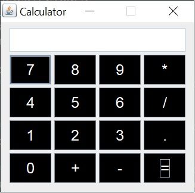

# java-calculator-basic

Este proyecto es modo consola.

## Pre Requisitos 🚀

1. Instalar Windows 10
2. Instalar Java 1.8.0_201
3. Instalar Gradle 4.4

## Instalacion 🔧

1. Clonar Repositorio: `https://github.com/RichardSeverich/java-calculator-basic`
2. Generar el JAR: `gradle build`
3. Iniciar programa: `java -jar build/libs/java-calculator-basic.jar`

## UI

### Calculadora basica

  

